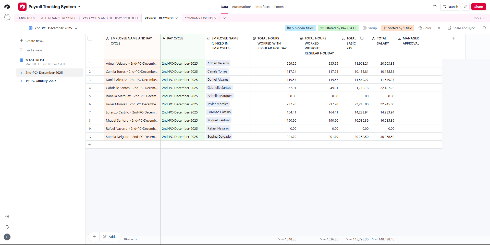

# Payroll Tracking System: A Technical Case Study

The Payroll Tracking System is a production-ready, automated solution designed to handle complex biometric data and transform it into an audit-ready payroll database. The system focuses on high-precision data engineering to ensure 100% accuracy in salary disbursement.

## Status: FUNCTIONAL AND VERIFIED
The system has been fully tested using raw biometric logs and successfully calculates payroll totals across different pay cycles while maintaining Philippine Labor Standard compliance. The automation for expense logging is currently active.

## Tech Stack and Architecture
* **Database Platform**: Airtable
* **Data Engineering**: Google Sheets / Excel (VLOOKUP and Unique Key Integration)
* **Logic Framework**: Custom Formula Scripts for Philippine Holiday Pay and Pay Cycle sorting.
* **Automation Engine**: Airtable Native Automations for Manager Approval workflows.

---

## Operational Demo & Deployment Proof

To demonstrate the system's reliability and precision, below is the link to the live architecture and the verification methods used to audit the data integrity:

### Live System Architecture & Verification
This system provides a BPI-ready output for bank disbursement. To ensure accuracy, a custom validation layer was developed using the `TEXT(hh:mm)` method to resolve floating-point errors often found in raw duration-based logs.

[**Airtable Live View (Read-Only)**](https://airtable.com/appsi0hox0v0osbUY/shr23HBY2MwZYnwdS)

---

## Key Features and Implementation

### 1. Data Analysis and Noise Filtering
Before implementation, I analyzed the provided data to separate essential fields from non-essential columns. I experimented with the data structure in Airtable to visualize how tables would interact, ensuring a scalable design for future employee growth.

### 2. The VLOOKUP Restructure (Technical Breakthrough)
While the core system could process the raw "In" and "Out" entries, I opted to restructure the data to improve readability and long-term system maintenance. This transformation simplifies the audit process by pairing logs into a single, comprehensive record:
* **The Problem**: Initial formulas like `Time Out = Time In + (Duration / 24)` caused 78 mismatches due to floating-point precision errors (e.g., 7:56 PM vs. 7:55 PM).
* **The Fix**: Implemented a `TEXT(H2, "hh:mm") = TEXT(E2, "hh:mm")` validation formula to verify alignment down to the exact minute.
* **Unique Keys**: Developed a custom Unique Key column by concatenating **Employee Name + Date** to ensure precise VLOOKUP alignment between calculated data and master logs.

### 3. Data Auditing and Edge Cases
Identified significant inconsistencies in the biometric logs, such as duplicate entries for specific employees (e.g., Miguel Santoro and Gabrielle Santos).
* **The Logic Solution**: Developed a fallback formula: `IF({DURATION} = 0, 0, {DURATION} - 1)` and `IF({DURATION} = 0, 0, IF( {DAY TYPE (from PAY CYCLES AND HOLIDAY SCHEDULE)} = "Regular Holiday", 8 + ({DURATION} - 1), {DURATION} - 1) )`. This ensured the system relied on validated durations to calculate wages accurately despite noisy raw logs.

### 4. Payroll Logic and Compliance
The system follows strict Philippine Labor standards for salary computation:
* **Normal Day**: Duration - 1 hour (unpaid lunch break).
* **Regular Holiday**: 8 hours (paid automatically) + total hours worked if duty was rendered.

---

## Advanced Automation: Manager Approval Workflow

To streamline financial tracking, I engineered an automation linking the Payroll Records to the Company Expenses table:

### 1. Condition-Based Trigger
The automation executes only if specific criteria are met:
* Total Salary is NOT 0 (to prevent erroneous logs).
* The Status column is Empty (to prevent redundant entries).
* Manager Approval checkbox is Checked.

### 2. Loop Prevention and Logging
Once the record is successfully generated in the Expenses table, the automation updates the Payroll Status to "APPROVED". This ensures that each transaction is only logged once.

---

## Summary of Implementation Steps

### 1. Backend Data Engineering
* Processed raw logs in Excel/Google Sheets to pair In/Out timestamps.
* Audited 78 discrepancies to achieve a 100% data match.

### 2. Airtable Configuration
* Created linked tables for Employees, Attendance, and Payroll Records.
* Configured dynamic filters for the 1st Pay Cycle (26th-10th) and 2nd Pay Cycle (11th-25th).

---

## Repository Structure
* **Systems and Automation_Payroll_Case Study.xlsx**: Original raw data and project objectives.
* **Restructured_Payroll_Data.xlsx**: Validated dataset featuring VLOOKUP and TEXT validation formulas.
* **Screenshots/**: Folder containing visual documentation.

---

## Developer Notes
This project demonstrates the transition from unorganized biometric logs to a high-integrity payroll system. By implementing a custom validation layer before database migration, the system ensures that every employee is paid accurately down to the minute.
